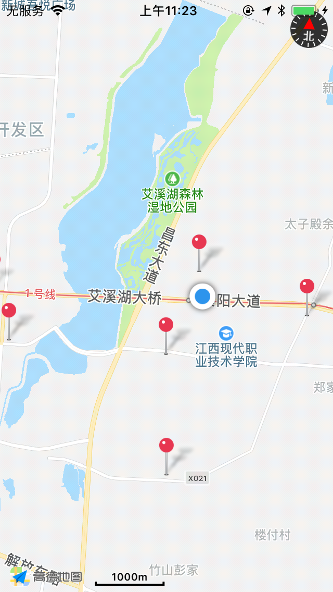

# 高德地图Cordova插件

## 相关说明
1. 申请高德地图应用与key [高德开放平台](https://lbs.amap.com)
2. android apk签名/生成签名 [参考文档](https://lbs.amap.com/faq/top/hot-questions/249)
    * 使用android studio -> Build -> Generate Signed Bundle/Apk... 可以生成一个签名文件
    * 查看安全码sha1： keytool -v -list -keystore [keystore文件路径]

## 安装命令
`cordova plugin add cordova-amap-mylocation --variable ANDROID_KEY=ANDROID开发密钥 --variable IOS_KEY=IOS开发密钥`

### 安装例子命令(注意空格 ANDROID_KEY=xxx， IOS_KEY=xxxx，等号之间不能有空格)
`cordova plugin add cordova-amap-mylocation --variable ANDROID_KEY=c40acfe3d1a57f5ef0307e031c42d582 --variable IOS_KEY=6c92e294244e5ea9a8b9ad134e401417`

### 参数说明
1. ANDROID_KEY:   ANDROID开发密钥
2. IOS_KEY:   IOS开发密钥

### 使用方法
1. 直接获取定位
```typescript
// typescript
window.CAMap.getMyLocation(
    success=>{
        alert(JSON.stringify(success));
    },
    error=>{
        alert(error);
    }
);
// javascript
// window.CAMap.getMyLocation(
//     function(success){
//         alert(JSON.stringify(success));
//     },
//     function(error){
//         alert(error);
//     },
// );
```

2. 定时获取
```javascript
// 可以使用setInterval方法定时获取
setInterval(() => {
    window.CAMap && window.CAMap.getMyLocation(
        success => {
            alert(JSON.stringify(success));
        },
        error => {
            alert(error);
        }
    );
}, 1000);
```

3. ANDROID提示打开GPS-只对ANDROID有用,IOS默认返回1:打开
```javascript
var CAMap = window.CAMap;

function errorFunc(error) {
    alert(error);
}

function getLocation() {
    // 检查GPS状态
    CAMap.checkGPS(function (isOpen) {

        alert("当前GPS状态:" + isOpen === 1 ? '开启' : '关闭');

        // 如果没有打开，那么提示用户要打开
        if (isOpen !== 1) {
            // 你可以显示一个提示界面,然后执行定位
            confirm('我们需要使用您的GPS，请到设置中开启')
                && CAMap.getMyLocation(function (location) {
                    alert(JSON.stringify(location));
                }, errorFunc)
        } else {
            // 直接获取定位信息
            CAMap.getMyLocation(function (location) {
                alert(JSON.stringify(location));
            }, errorFunc);
        }
    }, errorFunc);
}
```

### 例子
1. 本项目的example目录中有一个使用`cordova create example`创建的项目

### Android问题
1. 第一次使用的时候由于用户没有授权,定位会失败（建议一启动应用就执行`window.CAMap.checkGPS()`方法，进行授权，而调用定位的方法在对应页面执行即可）
2. 部分设备不打开GPS是无法定位的，定位信息为空（定位失败后再进行一次定位，直到得到一个正确的结果，`getMyLocation`方法会打开GPS设置页面）

### 代码更新
1. 高德地图显示（目前为打开一个简单地图，并显示定位的位置）

> 注意：IOS地图需要添加资源AMap.bundle，左侧目录中选中工程名，在右键菜单中选择Add Files to “工程名”…，从MAMapKit.framework中选择AMap.bundle文件，并勾选“Copy items if needed”复选框，单击“Add”按钮，将资源文件添加到工程中。（MAMapKit.framework已经在项目目录中了，比如example/ios/HelloCordova/Plugins/cordova-amap-mylocation/MAMapKit.framework）[参考文档](https://lbs.amap.com/api/ios-sdk/guide/create-project/manual-configuration)
2. 导航(点击地图上的标记会打开导航)
> > 注意：IOS导航需要添加资源AMapNavi.bundle，左侧目录中选中工程名，在右键菜单中选择Add Files to “工程名”…，从AMapNaviKit.framework中选择AMapNavi.bundle文件，并勾选“Copy items if needed”复选框，单击“Add”按钮，将资源文件添加到工程中。（AMapNaviKit.framework已经在项目目录中了，比如example/ios/HelloCordova/Plugins/cordova-amap-mylocation/AMapNaviKit.framework）[参考文档](https://lbs.amap.com/api/ios-sdk/guide/create-project/manual-configuration)
